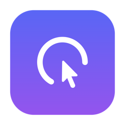

<p align="center">
  
</p>

<h1 align="center">ClickPulse</h1>

<p align="center">
  一个专注于<strong>鼠标点击统计</strong>的 macOS 菜单栏小工具 · 轻量 · 纯本地 · 隐私优先
</p>

---

## ✨ 功能

- 🖱 **全局点击统计**：时 / 日 / 周 / 月 / 总，可分 **左 / 右 / 中键** 查看
- ⚡ **实时跳动**：点击即 +1，0 延迟
- 📈 **趋势图**：近 30 天每日点击折线
- 🔥 **时段热力图**：7×24「星期 × 小时」网格，一眼看出哪个时段最活跃
- 📤 **导出**：CSV / JSON
- 🚀 **开机自启**：现代登录项（`SMAppService`，显示在「在登录时打开」）
- 🔒 **隐私优先**：纯本地 SQLite，零联网、无账号、无遥测
- 🪶 **轻量**：常驻约 60 MB、空闲 CPU 近 0%

## 📦 安装 / 构建

**依赖**：macOS 14+、Xcode、[XcodeGen](https://github.com/yonaskolb/XcodeGen)（`brew install xcodegen`）。

1. Clone 本仓库。
2. 在「钥匙串访问 → 证书助理 → 创建证书」建一个名为 **`ClickPulse Self-Signed`** 的 **Code Signing** 自签名证书（让系统授权长期稳定不失效；有效期建议设很长）。
3. 运行一键脚本：
   ```bash
   ./scripts/build.command
   ```
   它会自动：生成工程 → 编译 Release → 用证书签名 → 安装到 `/Applications` → 启动。
4. 首次运行后到 **系统设置 → 隐私与安全性 → 输入监控** 勾选 ClickPulse。

> 换机 / 重装时，用 `./scripts/resign.command <你的.p12>` 从备份证书恢复签名。

## 🧱 技术栈

| 领域 | 用了什么 |
|---|---|
| UI | SwiftUI + AppKit（菜单栏 `NSStatusItem` + `NSPopover`） |
| 状态管理 | Observation 框架（`@Observable`） |
| 图表 | Swift Charts |
| 数据 | GRDB.swift（SQLite，按小时粒度 + `DatabaseMigrator`） |
| 全局监听 | `CGEventTap`（`.listenOnly` → 输入监控权限） |
| 开机自启 | `SMAppService.mainApp`（现代登录项） |
| 工程 | XcodeGen（`project.yml` 生成 `.xcodeproj`） |

## 🏗 架构

```
捕获(CGEventTap) → 计数(os_unfair_lock 并发安全) → 落库(GRDB 按小时事实表)
    → 派生(@Observable StatsProvider) → UI(SwiftUI 面板)
```

时 / 日 / 周 / 月 / 总、热力图、趋势全部从同一张「小时 × 按键」事实表派生，统一本地时区口径。

## 🔐 隐私

只记录「**点击次数 + 时间（精确到小时）+ 按键类别**」，**不记录**鼠标坐标、窗口、应用或任何内容。数据存于本地 `~/Library/Application Support/com.liuzhuo.clickpulse/`，**绝不联网**。

## 📄 许可

[MIT](LICENSE)
